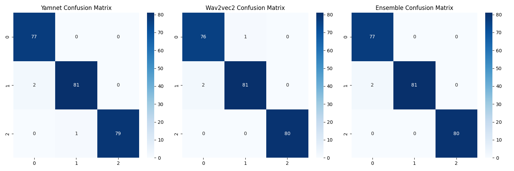
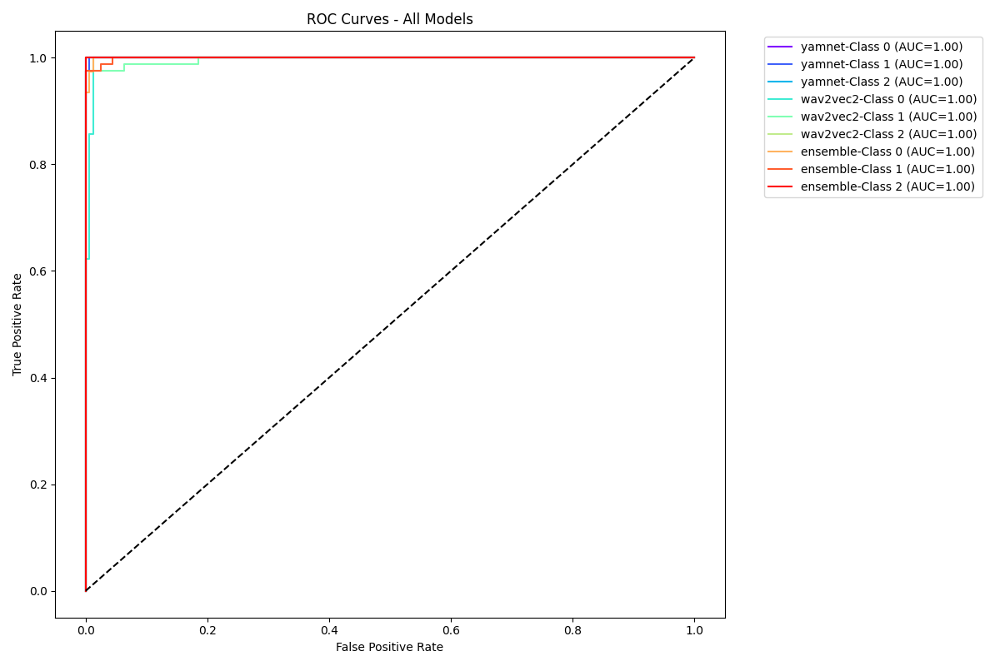

# Frontera Health Sound Detection

A robust audio classification system capable of distinguishing between infant cries, screams, and normal utterances using an ensemble of YAMNet and Wav2Vec2 models.

## Project Structure
```
Frontera_Health_Sound_detection/
├── dataset/
│   ├── infant_cry/      # 520 audio files
│   ├── normal_utterance/ # 535 audio files
│   └── scream/          # 550 audio files
├── models/              # Trained model checkpoints
│   ├── best_yamnet_fold_*_model.pt
│   └── best_wav2vec2_fold_*_model.pt
├── runs/                # Training logs and visualizations
├── frontera-health-training.ipynb  # Main training notebook
├── inference.py        # Inference script
├── requirements.txt    # Project dependencies  
└── README.md
```

## Dataset Information

The project uses three balanced audio datasets:
- **Infant Cry**: 520 files from Infant Cry Audio Corpus (Kaggle) and Infant's Cry Sound (Mendeley Data)
- **Screams**: 550 files from Human Screaming Detection Dataset (Kaggle)
- **Normal Utterances**: 535 files from Mozilla Common Voice Dataset

## Model Architecture

### Ensemble Components:
1. **YAMNet**: Fine-tuned audio classification model
2. **Wav2Vec2**: Fine-tuned speech recognition model
3. **Ensemble Method**: Probability averaging with model voting

### Training Approach:
- 5-fold cross-validation
- Progressive unfreezing
- Learning rate scheduling
- Early stopping
- Data augmentation (time stretching, pitch shifting)

## Usage

0. **Create a new conda environment**:
```bash
conda create -n frontera-health python=3.10
conda activate frontera-health
```

1. **Environment Setup**:
```bash
pip install -r requirements.txt
```

2. **Training**:
- Run the frontera-health-training.ipynb notebook
- Models and training artifacts will be saved in models and runs directories

3. **Inference**:
```bash
python inference.py --audio_path path/to/audio.wav
```

## Performance Metrics

The ensemble model achieves:
- Accuracy: 0.9917
- Precision: 0.9919
- Recall: 0.9917
- F1 Score: 0.9917

Visualizations:
- Confusion Matrix

- ROC Curve


